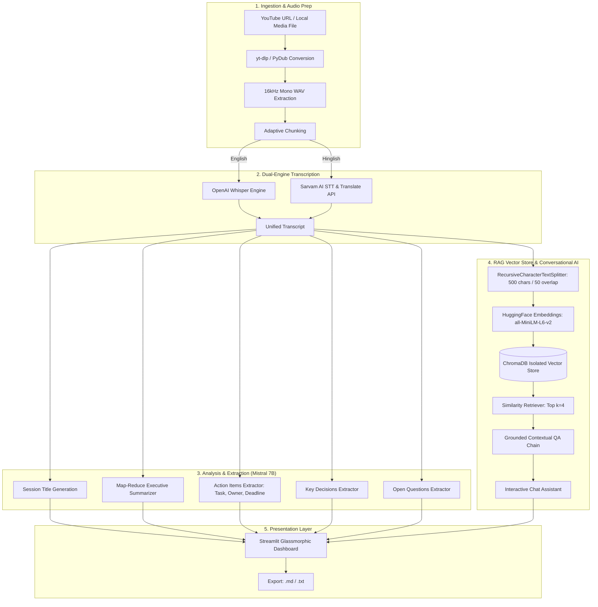

# 🎬 VideoMind AI — Meeting Intelligence & Video Assistant

[](https://www.python.org/)
[](https://streamlit.io/)
[](https://www.langchain.com/)
[](https://mistral.ai/)
[](https://github.com/openai/whisper)
[-6366F1.svg)](https://www.sarvam.ai/)
[](https://www.trychroma.com/)

**VideoMind AI** is an end-to-end meeting intelligence and video summarization platform designed to transform long-form recordings, podcasts, and YouTube videos into actionable insights. Powered by **OpenAI Whisper**, **Sarvam AI**, **Mistral AI**, and a **ChromaDB-backed Retrieval-Augmented Generation (RAG)** pipeline, it transcribes audio, extracts critical executive summaries, generates action items with assignees, and allows you to chat interactively with your meeting context.

---

## 📑 Table of Contents

- [System Architecture](#-system-architecture)
- [Key Features](#-key-features)
- [Technical Deep Dive](#-technical-deep-dive)
  - [1. Audio Ingestion & Preprocessing](#1-audio-ingestion--preprocessing)
  - [2. Dual-Engine Speech-to-Text (STT)](#2-dual-engine-speech-to-text-stt)
  - [3. Hierarchical Map-Reduce Summarization](#3-hierarchical-map-reduce-summarization)
  - [4. Structured Information Extraction](#4-structured-information-extraction)
  - [5. RAG Vector Search & Interactive QA](#5-rag-vector-search--interactive-qa)
- [User Interface (Glassmorphism)](#-user-interface-glassmorphism)
- [Getting Started](#-getting-started)
  - [Prerequisites](#prerequisites)
  - [Installation](#installation)
  - [Environment Configuration](#environment-configuration)
- [Running the Application](#-running-the-application)
  - [Streamlit Web Interface](#streamlit-web-interface)
  - [CLI Mode](#cli-mode)
- [Project Structure](#-project-structure)
- [Export Formats](#-export-formats)
- [Troubleshooting & FAQ](#-troubleshooting--faq)
- [License](#-license)

---

## 🏗️ System Architecture

The following diagram illustrates the complete data lifecycle, from media ingestion to conversational retrieval:



---

## ✨ Key Features

- **Universal Input Ingestion**: Supports YouTube URLs and multi-format audio/video uploads (`.mp4`, `.mp3`, `.wav`, `.m4a`, `.webm`, `.ogg`, `.avi`, `.mov`, `.mkv`).
- **Dual-Engine Transcription**:
  - **Whisper**: High-accuracy local speech-to-text for English media.
  - **Sarvam AI**: Specialized STT & translation for Indian accents and mixed **Hinglish** audio.
- **Hierarchical Map-Reduce Summarization**: Overcomes context window bottlenecks by summarizing chunk-by-chunk before synthesizing an executive briefing.
- **Structured Knowledge Extraction**:
  - 📋 **Executive Summary**: Clear bulleted breakdown of high-level discussion points.
  - ✅ **Action Items**: Automatically detects tasks, responsible assignees, and deadlines.
  - 🔑 **Key Decisions**: Pinpoints consensus decisions and critical agreements.
  - ❓ **Open Questions**: Tracks pending questions and unresolved discussions.
- **Grounded Conversational RAG**: Vectorizes transcripts on the fly using `all-MiniLM-L6-v2` and `ChromaDB` for real-time question answering with zero hallucination.
- **Glassmorphic UI**: High-end modern UI built with custom CSS, animated gradient mesh, frosted-glass panels, and real-time step trackers.
- **One-Click Exports**: Download structured reports as Markdown (`.md`) or Plain Text (`.txt`).

---

## 🔬 Technical Deep Dive

### 1. Audio Ingestion & Preprocessing
- **FFmpeg Auto-Discovery**: Automatically searches common Windows paths, winget locations, Chocolatey bins, and active virtual environments to initialize `ffmpeg` without manual path setting.
- **Audio Normalization**: Re-samples all audio streams to **16,000 Hz single-channel (mono)** PCM WAV to maximize speech recognition fidelity while minimizing processing memory footprint.
- **Chunking Strategy**: Slices long audio tracks into 10-minute segments for memory-safe transcription.

### 2. Dual-Engine Speech-to-Text (STT)
- **Local Whisper (`whisper`)**: Runs inference directly on your CPU/GPU with zero API latency. The default model is `base`, configurable via `WHISPER_MODEL` to `tiny`, `small`, `medium`, or `large`.
- **Sarvam AI Translation (`saaras:v2.5`)**: Handles multilingual and code-switched Hindi-English speech. Audio chunks are dynamically sliced into 25-second windows (complying with Sarvam's REST limits), translated, and merged into a cohesive English transcript.

### 3. Hierarchical Map-Reduce Summarization
Long-form transcripts can easily exceed single-prompt token limits. VideoMind uses a two-tier LangChain LCEL pipeline:
1. **Map Step**: Slices transcript into 3,000-character blocks with 200-character overlap; generates localized bulleted summaries for each block.
2. **Reduce Step**: Consolidates intermediate summaries into a single executive summary.

### 4. Structured Information Extraction
Three deterministic zero-shot extraction chains with low temperature (`0.2`) parse the full transcript to yield:
- **Action Items**: Explicitly tracks **Task Description**, **Owner**, and **Deadline** (defaulting to *"Not specified"* if omitted).
- **Key Decisions**: Identifies resolutions and consensus points.
- **Unresolved Questions**: Identifies follow-ups and unaddressed questions.

### 5. RAG Vector Search & Interactive QA
- **Chunking**: Splits transcripts using `RecursiveCharacterTextSplitter` (chunk size: `500`, overlap: `50`).
- **Embedding Model**: `sentence-transformers/all-MiniLM-L6-v2` via `HuggingFaceEmbeddings` (fast, lightweight, CPU-efficient).
- **Session Isolation**: Automatically purges and re-indexes `ChromaDB` per analysis run to avoid cross-meeting context leakage.
- **Hallucination Safeguard**: The system prompt strictly forces the assistant to rely exclusively on retrieved context (`k=4`) and gracefully decline out-of-scope inquiries.

---

## 🎨 User Interface (Glassmorphism)

The front-end is crafted with custom CSS injected directly into Streamlit:
- **Frosted Glass Cards**: Backdrops with `backdrop-filter: blur(16px)` and translucent borders.
- **Neon Highlights**: Gradient accents across purple (`#a855f7`), cyan (`#22d3ee`), pink (`#f472b6`), and emerald (`#4ade80`).
- **Typography Hierarchy**: Headings set in **Plus Jakarta Sans**, UI body in **Space Grotesk**, and technical metadata in **JetBrains Mono**.
- **Interactive State Tracking**: 6-stage glowing status pipeline providing real-time feedback during processing.

---

## 🚀 Getting Started

### Prerequisites

1. **Python**: Python 3.10 or higher.
2. **FFmpeg**: Required for audio transcoding.
   - **Windows** (via winget or choco):
     ```powershell
     winget install Gyan.FFmpeg
     # or
     choco install ffmpeg
     ```
   - **macOS** (via Homebrew):
     ```bash
     brew install ffmpeg
     ```
   - **Linux** (Debian/Ubuntu):
     ```bash
     sudo apt update && sudo apt install ffmpeg
     ```

---

### Installation

1. **Clone the repository**:
   ```bash
   git clone https://github.com/NULLPOINTERCODER/AI_POWERED_VIDEO_SUMAARY_EXPLAINER.git
   cd AI_POWERED_VIDEO_SUMAARY_EXPLAINER
   ```

2. **Create and activate a virtual environment**:
   ```bash
   # Windows
   python -m venv .venv
   .venv\Scripts\activate

   # Linux/macOS
   python3 -m venv .venv
   source .venv/bin/activate
   ```

3. **Install dependencies**:
   ```bash
   pip install -r Requirements.txt
   ```

---

### Environment Configuration

Create a `.env` file in the root directory (you can copy [.env.example](.env.example)):

```bash
cp .env.example .env
```

Populate the required credentials in `.env`:

```ini
# Mistral AI API Key for Summarization, Extraction, and RAG QA
MISTRAL_API_KEY=your_mistral_api_key_here

# Sarvam AI Key for Hinglish / Indian Regional Speech Translation
SARVAM_API_KEY=your_sarvam_api_key_here

# Optional Configurations
MISTRAL_MODEL=open-mistral-7b
WHISPER_MODEL=base
SARVAM_STT_MODEL=saaras:v2.5
```

> **Note**: An API key from [Mistral AI Console](https://console.mistral.ai/) is required. Sarvam AI key is only required if analyzing Hinglish content.

---

## 🖥️ Running the Application

### Streamlit Web Interface

Launch the web dashboard:

```bash
# Direct command
streamlit run app.py

# Or run the Windows batch script
run_app.bat
```

Once running, navigate to `http://localhost:8501` in your browser.

1. Select input mode: **YouTube URL** or **File Upload**.
2. Select language: **English** (Whisper) or **Hinglish** (Sarvam AI).
3. Click **⚡ Analyse Now** to initiate the pipeline.
4. Review summaries, decisions, action items, or chat in real time with the video context.

---

### CLI Mode

For terminal-based analysis without the web UI:

```bash
python main.py

# Or run the Windows batch script
run_cli.bat
```

Follow the prompts to enter a URL or file path, inspect stdout reports, and chat directly in the command line interface.

---

## 📂 Project Structure

```
AI_POWERED_VIDEO_SUMAARY_EXPLAINER/
│
├── app.py                   # Streamlit web dashboard with custom glassmorphic UI
├── main.py                  # CLI pipeline runner and interactive terminal chat
├── Requirements.txt         # Production dependencies
├── run_app.bat              # One-click Windows launch script for Streamlit
├── run_cli.bat              # One-click Windows launch script for CLI mode
├── .env.example             # Template for API credentials and model configurations
├── .gitignore               # Excludes secrets, virtual environments, audio cache & vector stores
│
├── core/                    # Core intelligence engines
│   ├── transcriber.py       # Whisper and Sarvam AI transcription orchestrator
│   ├── summarizer.py        # Map-reduce summarizer & title generator (Mistral AI)
│   ├── extractor.py         # Zero-shot extractor for action items, decisions & questions
│   ├── vector_store.py      # ChromaDB setup, text chunking & HuggingFace embeddings
│   └── rag_engine.py        # LangChain LCEL RAG QA chain & conversational interface
│
└── utils/                   # Utilities and audio processing
    └── audio_processor.py   # yt-dlp downloader, FFmpeg detector, PyDub audio chunker
```

---

## 📤 Export Formats

Exported meeting records encapsulate full session context into portable files:

- **Markdown (`.md`)**: Complete with structured headings, bulleted summaries, action item checklists, and verbatim transcript sections.
- **Plain Text (`.txt`)**: Clean text format suitable for archiving, email forwarding, or pasting into project management tools (Jira, Notion, Asana, Linear).

---

## 🔧 Troubleshooting & FAQ

<details>
<summary><b>1. FFmpeg not found or WinError 2</b></summary>
Ensure FFmpeg is installed and accessible. `utils/audio_processor.py` scans standard paths automatically, but you can also add FFmpeg to your system <code>PATH</code> manually.
</details>

<details>
<summary><b>2. Out of Memory (OOM) during Whisper transcription</b></summary>
The default Whisper model is <code>base</code>. If your CPU has limited RAM, you can set <code>WHISPER_MODEL=tiny</code> in your <code>.env</code> file. For high-end GPUs, upgrade to <code>WHISPER_MODEL=medium</code> or <code>large</code>.
</details>

<details>
<summary><b>3. UnicodeEncodeError on Windows Command Prompt</b></summary>
Both <code>app.py</code> and <code>main.py</code> feature automated UTF-8 stream reconfiguration (<code>sys.stdout.reconfigure(encoding='utf-8')</code>), ensuring emojis and non-ASCII transcript characters render without crashing.
</details>

<details>
<summary><b>4. Rate limits or timeouts with Sarvam AI</b></summary>
Sarvam's synchronous translation API restricts inputs to 30-second audio buffers. VideoMind automatically partitions chunks into 25-second micro-slices with retry management. Ensure your API key has active credits.
</details>

---

## 📜 License

This project is licensed under the [MIT License](LICENSE) — feel free to use, modify, and distribute it for personal or commercial projects.
